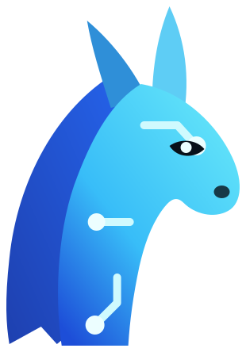

<div align="center">
  
  <h1>Llama AI Studio</h1>
  <p><strong>A local-first desktop application for discovering, managing, and running GGUF LLMs powered by llama.cpp.</strong></p>
</div>

---

## 🌟 Key Features

- 🔒 **100% Local & Private**: All model execution and chat data stay strictly on your local machine. No telemetry or external cloud API dependencies.
- 📂 **Smart Folder Scanning & Model Management**: Automatically scans local directories (`.gguf` files), detects architecture, quantization formats (`Q4_K_M`, `Q8_0`, etc.), vision projectors (`mmproj`), and validates split file models.
- 🔍 **Hugging Face Model Discovery**: Search and download GGUF quantization files directly from Hugging Face hub with real-time download progress tracking.
- 🎨 **3-Column Studio Interface**:
  - **Left Sidebar**: Organize chats into folders, filter message history, and create new conversations.
  - **Center Workspace**: Multi-modal chat pane with Markdown rendering, GGUF model selector, and attachment support.
  - **Right Inspector**: Real-time sampling controls (temperature, top-p, min-p, DRY penalty, Mirostat, sampler order) and native tool integrations.
- 🧠 **Collapsible Reasoning Traces**: Supports DeepSeek R1 and reasoning models (`<think>...</think>`), parsing reasoning thoughts into an expandable/collapsible toggle block while keeping the final answer clear.
- ⚡ **GPU Acceleration & Resource Detection**: Automatic hardware resource detection (CPU cores, RAM, NVIDIA CUDA / Vulkan VRAM) with memory estimation and custom GPU layer offloading controls.
- 🛠️ **Native `llama.cpp` Agent Tools**: Built-in supervisor for file reading/editing, glob searching, datetime checks, and shell command execution.

---

## 🛠️ Technology Stack

- **Desktop Framework**: [Electron](https://www.electronjs.org/) + [vite-plugin-electron](https://github.com/electron-vite/vite-plugin-electron)
- **Frontend Core**: [React 18](https://react.dev/) + [TypeScript](https://www.typescriptlang.org/)
- **Bundler & Build Tool**: [Vite 6](https://vitejs.dev/)
- **Inference Engine**: [`llama-server`](https://github.com/ggerganov/llama.cpp) binary supervisor
- **Styling & UI Icons**: Custom CSS Design System + [Lucide React](https://lucide.dev/)
- **Markdown & Code Highlighting**: `react-markdown` + `remark-gfm`
- **Testing**: [Vitest](https://vitest.dev/)

---

## 🚀 Getting Started

### Prerequisites

- **Node.js**: v18.x or higher
- **npm**: v9.x or higher
- **Operating System**: Windows 10/11 (or macOS / Linux)

### Installation

1. **Clone the repository**:
   ```bash
   git clone https://github.com/washim1982/Llama-AI-Studio.git
   cd Llama-AI-Studio
   ```

2. **Install dependencies**:
   ```bash
   npm install
   ```

---

## 💻 Development & Building

### Development Mode

Start the Vite dev server and launch Electron with hot-reloading:
```bash
npm run dev
```

### Type Checking & Testing

Run TypeScript type checks:
```bash
npm run typecheck
```

Run unit tests via Vitest:
```bash
npm test
```

### Packaging for Production

Build production assets and generate Windows installer / portable executable:

- **Build JS & Electron bundles**:
  ```bash
  npm run build
  ```

- **Package Portable Windows Binary (`.exe`)**:
  ```bash
  npm run package:portable
  ```

- **Package Windows NSIS Installer**:
  ```bash
  npm run package:win
  ```

---

## 📁 Project Structure

```
LLAMA-AI-STUDIO/
├── electron/                 # Electron main process & IPC handlers
│   ├── main.ts               # Window lifecycle & app initialization
│   ├── preload.ts            # Secure IPC bridge (window.forge API)
│   ├── server.ts             # llama-server process manager
│   ├── models.ts             # GGUF file scanner & metadata parser
│   ├── memory.ts             # VRAM / System RAM resource detector
│   └── llamaArgs.ts          # CLI flags builder for llama-server
├── src/                      # React frontend renderer
│   ├── components/           # Controls, SamplingPanel, Modals
│   ├── pages/                # ChatPage, ModelsPage, DiscoverPage, ServerPage, SettingsPage
│   ├── styles.css            # Dark mode design system & tokens
│   ├── chatStream.ts         # SSE stream parser & reasoning separator
│   └── App.tsx               # Main window shell & navigation rail
├── public/                   # Static branding & vector SVG assets
├── build/                    # App icons & installer assets (.ico, .png, .svg)
└── package.json              # App metadata & dependencies
```

---

## 📄 License

This project is open-source under the [MIT License](LICENSE).
