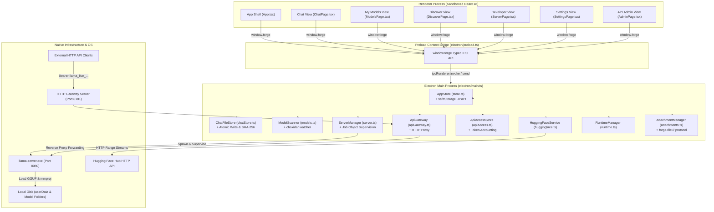

# Llama AI Studio — Project Architecture & Technical Implementation Document

**Version**: 0.3.6  
**Platform**: Windows 10/11 x64 (Cross-platform compatible with macOS & Linux)  
**Status**: Production / Enterprise Ready  

---

## 1. Executive Summary & Purpose

**Llama AI Studio** (also referred to as Llama Forge Studio) is a local-first desktop application designed for discovering, indexing, configuring, supervising, and securing GGUF language models locally using `llama-server` from [llama.cpp](https://github.com/ggml-org/llama.cpp).

The primary objective of Llama AI Studio is to bridge the gap between low-level command-line GGUF inference binaries and modern enterprise application requirements. It delivers:

1. **Complete Data Privacy & Local Autonomy**: Zero cloud dependencies or telemetry; 100% of data remains local.
2. **Robust Process Supervision**: Windows Job Object process isolation preventing ghost/orphaned background processes.
3. **Multimodal & Reasoning Model Support**: Text + `mmproj` vision projector pairing and DeepSeek R1 `<think>` reasoning trace parsing.
4. **Authenticated Multi-Tenant API Gateway**: An HTTP proxy gateway (`http://127.0.0.1:8181`) featuring Bearer authentication, token accounting, per-key cost calculation, rate-limiting, and an Admin Operations Dashboard.
5. **Resilient GGUF Management**: Automated magic byte validation (`0x46554747`), split file detection, debounced folder watching, and resumable Hugging Face downloads.

---

## 2. High-Level Architecture & Process Boundaries

The application uses an Electron multi-process architecture with strict process isolation, sandboxing, and explicit typed IPC communication.



### Process Boundary Protections
- **Renderer Sandboxing**: `sandbox: true`, `contextIsolation: true`, `nodeIntegration: false`. The React UI cannot execute Node.js APIs or access the filesystem directly.
- **Secure File Protocol**: Local image attachments are served via a custom, path-bounded `forge-file://` scheme that rejects traversal attempts outside `userData/attachments`.
- **IPC Payload Guarding**: Input parameters received in `main.ts` IPC handlers undergo strict validation and path resolution checks before execution.

---

## 3. Core Technical Subsystems & Components

### 3.1 Process Supervision & Server Lifecycle (`electron/server.ts`, `llamaArgs.ts`, `memory.ts`, `runtime.ts`)
- **Windows Job Object Supervision**: On Windows, child processes (`llama-server.exe`) are bound to a Job Object configured with `JOB_OBJECT_LIMIT_KILL_ON_JOB_CLOSE`. When Electron closes, crashes, or is killed, the kernel automatically terminates `llama-server.exe`.
- **Dynamic Port Fallback**: Before spawning `llama-server.exe`, `ServerManager` tests port availability (default 8080). If port 8080 is blocked, it probes ports `8081–8099`, updates the active status, and notifies the UI.
- **CLI Argument Builder (`llamaArgs.ts`)**: Translates `LoadConfig` into command-line arguments (e.g. `-c`, `-ngl`, `-b`, `-ub`, `-np`, `--ctk`, `--ctv`, `--flash-attn`). Always includes `--no-ui` so `llama-server` operates purely as a supervised backend.
- **Circuit Breaker Policy**: Supervises process exit codes. On unexpected failure, it attempts auto-restart up to 3 times with exponential backoff (2s, 5s, 10s). If failures persist within 5 seconds of launch, restarts halt and a diagnostic error is emitted.

### 3.2 GGUF Discovery & Model Library (`electron/models.ts`, `gguf.ts`)
- **Header Magic Bytes Validation**: Inspects the first 4 bytes of GGUF files to verify magic header `0x46554747` (`GGUF`) and version compatibility (v2/v3). Invalid headers or truncated files are marked as invalid in the index rather than crashing the scan.
- **Multimodal Text + `mmproj` Pairing**: Enables pairing text GGUF models with vision projector files (`mmproj.gguf`). When paired, `ServerManager` passes `--mmproj <path>` during spawn, enabling multimodal vision features in Chat.
- **Split File Aggregation**: Detects multi-part GGUF model sets (`*-00001-of-00005.gguf`), grouping them into a single logical model entry while verifying total file size.
- **Debounced File Supervision**: Monitors model directories using `chokidar` with a 1,500 ms debounce buffer to prevent file lock conflicts during copy operations.

### 3.3 Data Persistence & Cryptography (`electron/chatStore.ts`, `store.ts`)
- **Atomic JSON Writes with Checksums**: `ChatFileStore` writes each conversation JSON atomically via `write-file-atomic` along with a SHA-256 sidecar file (`.json.sha256`). On read, if SHA-256 verification fails, the store automatically falls back to the most recent backup file (`.json.bak`).
- **Encrypted Credential Storage (`store.ts`)**: Sensitive configuration values (such as Hugging Face access tokens) are encrypted on disk using Electron's `safeStorage` API (backed by Windows DPAPI).

### 3.4 Authenticated API Gateway & Admin Operations (`electron/apiGateway.ts`, `apiAccess.ts`)
- **Reverse Proxy Engine**: Runs an HTTP server (`http://127.0.0.1:8181`) that authenticates and proxies incoming requests to `llama-server`.
- **Bearer & Key Authentication**: Validates incoming `Authorization: Bearer llama_live_...` or `x-api-key` headers against active hashed API keys (`hashApiKey` using SHA-256).
- **Token Accounting & Real-Time Stream Inspection**: `UsageTracker` inspects standard JSON bodies and SSE streaming chunks (`text/event-stream`), extracting prompt (`prompt_tokens`) and completion (`completion_tokens`) counts.
- **Admin Dashboard Telemetry**: `ApiAccessStore` aggregates metrics into an `AdminDashboardSnapshot`:
  - **Summary**: Total requests, error counts, total tokens, total cost, P95 latency (ms).
  - **Keys**: List of active/revoked API keys, token usage, spend, and last request timestamp.
  - **Traffic Bucketing**: 24-hour hourly traffic buckets (`ApiUsageBucket`).
  - **Trace Logs**: Rolling array of metadata-only request traces (`ApiTrace`), capturing endpoint, model, status, TTFB, tokens, and event milestones without storing prompt content.

### 3.5 Download Engine & Offline Reliability (`electron/huggingface.ts`)
- **Resumable Range Downloads**: Downloads GGUF files from Hugging Face Hub using HTTP Range requests (`Range: bytes=X-`), streaming data to `.partial` files.
- **Checksum Verification**: Validates downloaded file size and SHA-256 checksums against Hugging Face LFS pointers before renaming `.partial` to `.gguf`.
- **Air-Gapped / Offline Toggle**: An `offlineMode` setting blocks all outbound network requests for air-gapped security.

### 3.6 UI Architecture & Pages (`src/`)
- **`App.tsx` Shell**: View switcher (`chat`, `models`, `discover`, `server`, `admin`, `settings`), navigation rail, custom draggable titlebar, and shared IPC listener hooks.
- **`ChatPage.tsx`**: 3-column workspace featuring folder-based conversation sidebar, message timeline with DeepSeek R1 collapsible `<think>` reasoning traces, Markdown formatting, image attachment composer, and right parameter inspector (`SamplingPanel`).
- **`ModelsPage.tsx`**: Model library table, preflight VRAM & RAM load estimate calculator (`memoryEstimate.ts`), text + vision projector (`mmproj`) pairing manager, and Explorer launcher.
- **`DiscoverPage.tsx`**: Hugging Face GGUF repository explorer, quantization download selector (`Q4_K_M`), and download progress monitor.
- **`ServerPage.tsx`**: Developer dashboard displaying llama-server status, OpenAI API base URL, VRAM usage, KV pressure, active slots, real-time stdout/stderr log console, and cURL reference topics (`developerReference.ts`).
- **`AdminPage.tsx`**: API key generator, key revocation, input/output token rate configuration, traffic graphs, token usage summaries, and request trace inspector.
- **`SettingsPage.tsx`**: Executable path picker, theme settings, API Gateway settings, air-gapped mode toggle, and one-click diagnostic log exporter (`sys:export-diagnostics`).

---

## 4. Shared Data Contracts (`src/types.ts`)

```typescript
export type ViewId = 'chat' | 'models' | 'discover' | 'server' | 'admin' | 'settings';

export interface AppState {
  settings: AppSettings;
  runtime: RuntimeInfo;
  models: GgufModel[];
  chats: ChatSummary[];
  activeChatId: string | null;
  serverStatus: ServerStatus;
  isScanningModels: boolean;
  activeDownload?: DownloadProgress;
}

export interface AppSettings {
  runtimePath: string;
  backendType: 'cpu' | 'vulkan' | 'cuda12' | 'cuda13' | 'custom';
  modelFolders: string[];
  downloadFolder: string;
  hfToken?: string;
  defaultLoadConfig: LoadConfig;
  defaultSamplingConfig: SamplingConfig;
  startupLoadEnabled: boolean;
  theme: 'dark' | 'light' | 'system';
  offlineMode: boolean;
  enableAgentTools: boolean;
  autoPortFallback: boolean;
  apiGateway: ApiGatewaySettings;
}

export interface ApiGatewaySettings {
  enabled: boolean;
  host: string;
  port: number;
  defaultInputCostPerMillion: number;
  defaultOutputCostPerMillion: number;
}

export interface GgufModel {
  id: string;
  name: string;
  filePath: string;
  fileSizeBytes: number;
  architecture: string;
  parameterCount: string;
  quantization: string;
  contextLength: number;
  embeddingLength: number;
  blockCount: number;
  attentionHeads: number;
  isValid: boolean;
  validationError?: string;
  pairingMmprojPath?: string;
  isSplit: boolean;
  splitFilePaths?: string[];
  capabilities: {
    vision: boolean;
    reasoning: boolean;
    tools: boolean;
    embedding: boolean;
  };
  lastModified: number;
}

export interface ApiKeyRecord {
  id: string;
  userName: string;
  prefix: string;
  createdAt: number;
  lastUsedAt?: number;
  revokedAt?: number;
  inputCostPerMillion: number;
  outputCostPerMillion: number;
}

export interface ApiTrace {
  id: string;
  requestId: string;
  apiKeyId?: string;
  apiKeyName: string;
  method: string;
  path: string;
  endpoint: string;
  model?: string;
  status: number;
  startedAt: number;
  durationMs: number;
  timeToFirstByteMs?: number;
  promptTokens: number;
  completionTokens: number;
  totalTokens: number;
  cost: number;
  streaming: boolean;
  clientIp?: string;
  error?: string;
  events: ApiTraceEvent[];
}
```

---

## 5. Testing & Quality Assurance Architecture

The test suite is powered by **Vitest** (`vitest@2.1.8`) and covers all main process modules:

| Test Module | Coverage Scope |
| --- | --- |
| `electron/server.test.ts` | Server lifecycle, process spawn, error handling, status transitions |
| `electron/apiGateway.test.ts` | Proxy request forwarding, header filtering, CORS, 401 unauth handling |
| `electron/apiAccess.test.ts` | API Key creation, SHA-256 hashing, token accounting, traffic bucketing |
| `electron/chatStore.test.ts` | Atomic JSON chat writes, SHA-256 sidecar checksums, backup restoration |
| `electron/models.test.ts` | Recursive GGUF directory scanning, split-file parsing, watcher triggers |
| `electron/llamaArgs.test.ts` | LoadConfig to CLI argument mapping, quoted token parsing |
| `electron/memory.test.ts` | Log memory line parsing (VRAM, model buffer, KV buffer) |
| `electron/runtime.test.ts` | Runtime binary version checks, executable path validation |
| `electron/attachments.test.ts` | Image attachment hash generation, extension safety checks |

### Running Tests
```powershell
# Execute complete unit test suite
npm test

# Execute TypeScript strict type checking
npm run typecheck
```

---

## 6. Build, Packaging, and Operational Guidance

### Development Workflow
```powershell
npm install
npm run dev
```

### Packaging & Distribution
```powershell
# Build Vite production bundles
npm run build

# Package Windows Portable Executable (.exe)
npm run package:portable

# Package Windows NSIS Installer
npm run package:win
```

Build outputs are compiled to `release/`:
- `release/Llama Forge Studio-<version>.exe` (Portable executable)
- `release/Llama Forge Studio Setup <version>.exe` (NSIS installer)

---

## 7. Security Model & Summary Checklist

- [x] Renderer Sandboxing enabled (`contextIsolation`, `sandbox: true`, `nodeIntegration: false`).
- [x] Process Isolation via Windows Job Objects (`JOB_OBJECT_LIMIT_KILL_ON_JOB_CLOSE`).
- [x] API Key Encryption at Rest via Electron `safeStorage` (Windows DPAPI).
- [x] Authenticated Gateway Proxy with SHA-256 key hashing & token accounting.
- [x] Resumable downloads with SHA-256 checksum verification.
- [x] Private path-bounded `forge-file://` scheme for multimodal attachment security.
- [x] Air-Gapped / Offline operating mode for isolated enterprise environments.
- [x] Complete Vitest unit test coverage across all backend modules.
