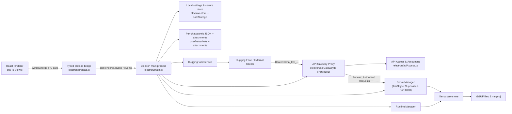

# Llama AI Studio — Project Context & Engineering Requirements

Last reviewed: 2026-08-14  
Application version: 0.3.6  
Primary platform: Windows 10/11 x64 (Supports macOS & Linux)

## 1. Purpose

Llama AI Studio (also known as Llama Forge Studio) is a local-first, enterprise-grade Electron desktop application for discovering, indexing, configuring, supervising, and securing GGUF language models locally using `llama-server` from [llama.cpp](https://github.com/ggml-org/llama.cpp).

The application provides:

- **Local & Resilient GGUF Model Library**: Automated header validation (`GGUF` `0x46554747`), split file detection (`-00001-of-00005.gguf`), and vision projector (`mmproj.gguf`) text/vision pairing.
- **Hugging Face Discovery Engine**: Direct GGUF repo search, quantization recommendations (`Q4_K_M`), resumable range downloads, disk space checks, and SHA-256 verification.
- **Runtime Management**: Automatic detection and installation of CPU, Vulkan, CUDA 12, and CUDA 13 backends with device VRAM inspection.
- **3-Column Studio Interface**:
  - *Sidebar*: Organized conversation history with folder labels and fast search.
  - *Main Chat*: Multi-modal Markdown chat timeline, syntax highlighting, collapsible DeepSeek R1 reasoning traces (`<think>`), and image attachments.
  - *Inspector Panel*: Granular live sampling controls (temperature, top-p, min-p, top-k, DRY penalties, Mirostat) and native tool integrations.
- **Server Supervision**: Pinned-model and on-demand router modes with Windows Job Object process isolation, dynamic port fallback (8080–8099), and preflight hardware VRAM load estimation.
- **Authenticated API Gateway & Admin Operations**: Built-in HTTP proxy (`http://127.0.0.1:8181`) with Bearer token authentication, per-key token cost tracking, P95 latency analytics, hourly traffic bucketing, CORS controls, and metadata-only trace logs.
- **Developer Dashboard**: Live process stdout/stderr console, server metrics telemetry, and OpenAI-compatible cURL API reference.

The Studio supervises `llama-server`; it does not implement model inference itself. External clients can connect directly to `llama-server` (`http://127.0.0.1:8080/v1`) or through the authenticated API Gateway (`http://127.0.0.1:8181/v1`).

## 2. Technology stack

| Layer | Implementation |
| --- | --- |
| Desktop shell | Electron 33 (`electron@33.2.1`) |
| Renderer | React 18 + TypeScript (`react@18.3.1`, `typescript@5.7.2`) |
| Bundler | Vite 6 with `vite-plugin-electron` & `vite-plugin-electron-renderer` |
| Icons | Lucide React (`lucide-react@0.469.0`) + generated artwork |
| Markdown & Syntax | `react-markdown`, `remark-gfm`, `react-syntax-highlighter` |
| Settings & Security | `electron-store` + Electron `safeStorage` (DPAPI encryption) |
| Runtime/inference | Supervised external `llama-server.exe` process |
| Gateway & Access | Custom HTTP API Gateway with SHA-256 key hashing & token accounting |
| Model source | Local filesystem & Hugging Face HTTP APIs |
| Tests | Vitest unit test suite (`vitest@2.1.8`) |
| Packaging | `electron-builder` (Portable EXE & NSIS installer targets) |

TypeScript strict mode is enabled across renderer, main process, and preload scripts.

## 3. High-level architecture



### Process boundary & Security sandbox

The renderer is strictly sandboxed:

- `sandbox: true`
- `contextIsolation: true`
- `nodeIntegration: false`

The renderer cannot directly access Node.js, files, processes, or Electron APIs. It communicates exclusively via `window.forge` exposed by `electron/preload.ts`.

## 4. Source tree

```text
LLAMA-AI-STUDIO/
├── src/
│   ├── App.tsx                    Application shell, 6-view router, titlebar
│   ├── main.tsx                   React DOM entry point
│   ├── types.ts                   Shared TypeScript contracts across processes
│   ├── chatStream.ts              SSE stream buffering & reasoning trace separator
│   ├── memoryEstimate.ts          Preflight model & KV cache memory calculator
│   ├── developerReference.ts      API documentation and copyable cURL snippets
│   ├── utils.ts                   Formatting and helper utilities
│   ├── styles.css                 Complete dark graphite theme and CSS tokens
│   ├── pages/                     
│   │   ├── ChatPage.tsx           3-column chat workspace & reasoning viewer
│   │   ├── ModelsPage.tsx         Model library table, inspector, mmproj pairing
│   │   ├── DiscoverPage.tsx       Hugging Face GGUF model explorer & downloader
│   │   ├── ServerPage.tsx         Developer dashboard & process log console
│   │   ├── SettingsPage.tsx       Application settings, offline mode, diagnostics
│   │   └── AdminPage.tsx          API Key manager, usage dashboard, trace logs
│   ├── components/                
│   │   ├── Controls.tsx           Button, Field, Select, Toggle, StatusPill, Notice
│   │   ├── ErrorBoundary.tsx      React component-level error boundary
│   │   ├── LoadConfigPanel.tsx    llama-server startup parameters editor
│   │   └── SamplingPanel.tsx      Generation sampling parameters editor
│   └── assets/                    Vector SVG branding assets
├── electron/
│   ├── main.ts                    Window lifecycle, IPC handlers, app init
│   ├── preload.ts                 Typed, isolated renderer IPC bridge
│   ├── server.ts                  llama-server supervisor & Job Object lifecycle
│   ├── server.test.ts             Server manager unit tests
│   ├── apiGateway.ts              Authenticated HTTP API proxy server
│   ├── apiGateway.test.ts         API Gateway proxy unit tests
│   ├── apiAccess.ts               API key hashing, token accounting, traces
│   ├── apiAccess.test.ts          API Access store unit tests
│   ├── runtime.ts                 llama.cpp runtime detector & version inspector
│   ├── runtime.test.ts            Runtime manager unit tests
│   ├── models.ts                  Async GGUF scanner & chokidar watcher
│   ├── models.test.ts             Model scanner unit tests
│   ├── gguf.ts                    GGUF v2/v3 header validator & metadata parser
│   ├── huggingface.ts             Hugging Face search & resumable downloader
│   ├── attachments.ts             Managed attachments & forge-file protocol
│   ├── attachments.test.ts        Attachment manager unit tests
│   ├── store.ts                   AppStore with safeStorage DPAPI encryption
│   ├── chatStore.ts               Atomic JSON chat store with SHA-256 sidecars
│   ├── chatStore.test.ts          Chat store unit tests
│   ├── llamaArgs.ts               LoadConfig to CLI argument translator
│   ├── llamaArgs.test.ts          CLI argument translator unit tests
│   ├── memory.ts                  VRAM / RAM log metric parser
│   ├── memory.test.ts             Memory parser unit tests
│   └── defaults.ts                Default application settings and presets
├── build/                         Application icons (.ico, .png, .svg)
├── scripts/                       Icon generators and GGUF inspection tools
├── package.json                   Metadata, scripts, and dependencies
├── vite.config.ts                 Vite build and Electron plugin config
├── vitest.config.ts               Vitest test runner configuration
└── tsconfig.json                  TypeScript compiler configuration
```

## 5. Architectural Subsystems & Engineering Specifications

### 5.1 System Resilience & Process Supervision (Section 14)
- **Windows Job Object Binding**: All `llama-server.exe` child processes are assigned to a Windows Job Object configured with `JOB_OBJECT_LIMIT_KILL_ON_JOB_CLOSE`, guaranteeing zero orphaned background processes if Electron terminates unexpectedly.
- **Dynamic Port Fallback**: If default port 8080 is blocked, the supervisor automatically selects an open port in the `8081–8099` range and broadcasts the new endpoint via IPC.
- **VRAM Sanity Guard**: Queries available physical RAM and GPU VRAM before model load to prevent system freeze or TDR resets.
- **Circuit Breaker**: Exponential backoff restart policy (2s, 5s, 10s delay). Auto-restarts halt if crash occurs within 5 seconds of boot.

### 5.2 Security, Cryptography & Storage Safety (Section 15)
- **Encryption at Rest**: Sensitive properties (e.g. Hugging Face tokens, custom secrets) are encrypted using Electron's `safeStorage` (Windows DPAPI).
- **Atomic Chat Persistence**: Uses `write-file-atomic` with a SHA-256 sidecar file. If JSON verification fails, the store automatically rolls back to the latest `.bak` backup file.
- **API Key Security**: Only SHA-256 digests (`hashApiKey`) of client API keys are persisted on disk; secret strings (`llama_live_...`) are displayed once upon generation.

### 5.3 Model Integrity & Vision Projector Pairing (Section 16)
- **Header Integrity**: Validates the 4-byte GGUF magic bytes (`0x46554747`) and version compatibility (v2/v3).
- **Multimodal `mmproj` Pairing**: Allows pairing text GGUF models with matching vision projectors (`mmproj.gguf`), enabling image attachment in Chat only when a valid projector is bound.
- **Split GGUF Detection**: Automatically matches split model parts (`*-00001-of-00005.gguf`) into a single logical model entry.
- **Debounced File Watching**: Uses `chokidar` with a 1,500 ms buffer to supervise model directories without file-lock contention.

### 5.4 Download Engine & Air-Gapped Operation (Section 17)
- **Resumable Downloads**: Uses HTTP Range headers to resume interrupted transfers from Hugging Face Hub.
- **SHA-256 Verification**: Verifies completed downloads against LFS pointer SHA-256 hashes before renaming `.partial` files to `.gguf`.
- **Disk Pre-allocation**: Verifies free drive space (+1 GB buffer) before download initialization.
- **Air-Gapped Mode**: Built-in toggle to disable all outbound HTTP requests in secure offline environments.

### 5.5 Authenticated API Gateway & Admin Operations
- **Reverse Proxy Gateway**: Spawns an HTTP gateway on port `8181` to proxy requests to `llama-server`.
- **Bearer & Key Authentication**: Validates incoming `Authorization: Bearer llama_live_...` or `x-api-key` headers against active API keys.
- **Token Accounting & Cost Estimation**: Captures input (prompt) and output (completion) tokens across standard and SSE streaming responses, computing cost based on custom per-million token rates.
- **Admin Dashboard**: Real-time traffic graphs, active key counts, P95 latency analytics, error rates, and metadata-only trace logs.

### 5.6 UI Performance & Reasoning Traces (Section 18)
- **React Error Boundaries**: Component-level error boundaries with soft reset capability to eliminate total app crashes.
- **Collapsible Reasoning Traces**: Parses `<think>...</think>` tags (from DeepSeek R1 / Reasoning models) into dedicated expandable reasoning blocks in the chat view.
- **Diagnostic Package Export**: One-click system diagnostic export creating a `.zip` archive containing anonymized logs, system hardware specs, and runtime telemetry.

## 6. Build, Test, and Packaging

```powershell
# Development
npm run dev

# Type check & Unit tests
npm run typecheck
npm test

# Production Build & Packaging
npm run build
npm run package:portable
npm run package:win
```

Vitest runs unit test suites across all backend modules (`electron/*.test.ts`). `electron-builder` packages signed or unsigned portable EXE and NSIS installer binaries to `release/`.
