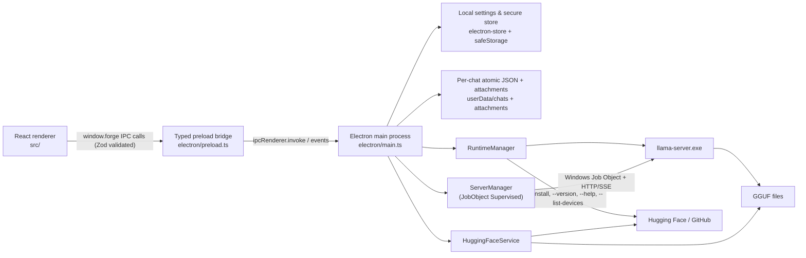

# Llama AI Studio — Project Context & Engineering Requirements

Last reviewed: 2026-07-26  
Application version: 0.3.6  
Primary platform: Windows 10/11 x64

## 1. Purpose

Llama AI Studio (also known as Llama Forge Studio) is a local-first, enterprise-grade Electron desktop application for discovering, indexing, configuring, and running GGUF language models locally using `llama-server` from [llama.cpp](https://github.com/ggml-org/llama.cpp).

The application provides:

- A local, resilient GGUF model library with automated metadata parsing.
- Hugging Face GGUF discovery and verified multi-part downloads.
- Runtime management for CPU, Vulkan, CUDA 12, and CUDA 13 backends.
- Persistent local conversations with Markdown, reasoning, image attachments, and low-latency SSE streaming.
- Detailed model-loading, KV-cache, sampling, and server settings.
- Pinned-model and on-demand/router server modes.
- Developer dashboard, log observer, and local API reference.

The Studio supervises `llama-server`; it does not implement model inference itself. External clients connect directly to the spawned `llama-server` HTTP endpoint, normally `http://127.0.0.1:8080/v1`.

## 2. Technology stack

| Layer | Implementation |
| --- | --- |
| Desktop shell | Electron 33 |
| Renderer | React 18 + TypeScript |
| Bundler | Vite 6 with `vite-plugin-electron` |
| Icons | Lucide React plus generated application artwork |
| Markdown | `react-markdown` with `remark-gfm` |
| Settings storage | `electron-store` + Electron `safeStorage` |
| Runtime/inference | External `llama-server.exe` process (supervised) |
| Model source | Local filesystem and Hugging Face HTTP APIs |
| Tests | Vitest in a Node environment |
| Packaging | `electron-builder`, portable EXE and NSIS targets |

TypeScript strict mode is enabled across both renderer and Electron codebases.

## 3. High-level architecture



### Process boundary & Security sandbox

The renderer is strictly sandboxed:

- `sandbox: true`
- `contextIsolation: true`
- `nodeIntegration: false`

The renderer cannot directly access Node.js, files, processes, or Electron APIs. It can only use the typed API exposed as `window.forge` by `electron/preload.ts`.

## 4. Source tree

```text
Local-LM-Studio/
├── src/
│   ├── App.tsx                    Application shell, router, and global state
│   ├── pages/                     Chat, Models, Discover, Developer, Settings
│   ├── components/                Reusable controls, load config, sampling panels
│   ├── types.ts                   Shared renderer/main-process contracts
│   ├── chatStream.ts              Streaming chunk buffering and presentation
│   ├── memoryEstimate.ts          Preflight model/KV VRAM & RAM estimate
│   ├── developerReference.ts      Developer topic documentation data
│   └── styles.css                 Complete renderer layout and theme tokens
├── electron/
│   ├── main.ts                    Window setup, process signals, and IPC handlers
│   ├── preload.ts                 Typed, isolated renderer bridge with validation
│   ├── server.ts                  llama-server lifecycle, Job Objects, and streaming
│   ├── runtime.ts                 Runtime selection, GPU detection, and installer
│   ├── models.ts                  Async GGUF discovery and file watching
│   ├── gguf.ts                    Bounded GGUF metadata parser & validation
│   ├── huggingface.ts             Search, SHA-256 verification, and downloads
│   ├── store.ts                   Settings/model persistence and migrations
│   ├── chatStore.ts               Atomic per-chat persistence with SHA-256 sidecars
│   ├── attachments.ts             Managed image storage and private URLs
│   ├── llamaArgs.ts               LoadConfig-to-CLI argument translation
│   ├── memory.ts                  Runtime log/metrics/slot parsing
│   └── defaults.ts                Default load, sampling, and app settings
├── build/
│   ├── icon-source.png            Source application artwork
│   ├── icon.ico / icon.png        Generated application assets
│   └── after-pack.cjs             Windows executable icon injection
├── scripts/
│   ├── make-icon.mjs              Multi-resolution ICO/PNG generator
│   ├── inspect-gguf.ts            GGUF inspection utility
│   └── scan-models.ts             Model scanning utility
├── public/icon.png                Renderer/favicon icon
├── package.json                   Scripts, dependencies, packaging config
└── vite.config.ts                 Renderer, main, and preload builds
```

## 5. UI implementation & Layout Architecture

### 5.1 Application shell

`src/App.tsx` owns the shared `AppState` returned by `app:get-state`:

- Application settings.
- Runtime information.
- Indexed model summaries.
- Chat summaries.
- Current server status.

The selected model ID is owned at this level so Chat, Models, and Developer views stay synchronized. Server-status and runtime-progress events update the shared state without re-fetching state.

The application uses an explicit view switch (`activeView`):

1. Chat
2. My models
3. Discover
4. Developer
5. Settings

### 5.2 Theme and styling

Styles are defined in `src/styles.css`. The primary design system uses CSS variable design tokens:

```css
:root {
  --bg: #151516;
  --workspace: #181819;
  --panel: #1e1e20;
  --panel-2: #242426;
  --panel-3: #2b2b2e;
  --panel-4: #343438;
  --control: #2a2a2d;
  --console: #101011;
  --accent: #7c3aed;
  --accent-hover: #6d28d9;
}
```

The layout uses CSS Grid with explicit `min-height: 0` and bounded internal scroll regions to prevent body-level layout shifts.

### 5.3 Chat Page & Message Virtualization

Implemented in `src/pages/ChatPage.tsx`.

- **Three-column layout**: Chat library sidebar, main conversation timeline, and parameter inspector.
- **Message List Virtualization**: For threads exceeding 50 messages, virtualized list rendering is active to ensure smooth 60 FPS scrolling and low DOM overhead.
- **Markdown & Code Rendering**: Assistant messages render GFM Markdown with syntax highlighting and action copy buttons.
- **Reasoning Panel**: Dynamic block displaying model chain-of-thought output.
- **Multimodal Support**: Attachments mapped to private `forge-file://` URLs.

### 5.4 Models Page & Discovery

Implemented in `src/pages/ModelsPage.tsx` and `src/pages/DiscoverPage.tsx`.

- Searchable GGUF model library with filtering by quantization, parameter size, and architecture.
- Direct Hugging Face repository exploration with default `Q4_K_M` recommendations and multi-file download manager.
- Hardware requirements preview showing estimated VRAM/RAM load against actual system specs.

### 5.5 Developer Page & Settings

Implemented in `src/pages/ServerPage.tsx` and `src/pages/SettingsPage.tsx`.

- Dashboard displaying running process PID, port, OpenAI base URL, VRAM usage, KV pressure, and active request slots.
- Live streaming log console with filter controls and copy capabilities.
- Complete API documentation and interactive cURL quickstart snippets.

## 6. Shared Data Contracts

`src/types.ts` defines all contracts across main and renderer processes:

| Type | Responsibility |
| --- | --- |
| `AppState` | Initial application snapshot |
| `AppSettings` | Runtime path, model folders, defaults, presets, security settings |
| `GgufModel` | Indexed model metadata, validation status, and split-file mapping |
| `LoadConfig` | `llama-server` startup configuration |
| `SamplingConfig` | Generation and logit bias configuration |
| `ChatSummary` | Lightweight conversation index record |
| `ChatSession` | Complete persisted conversation history |
| `ChatMessage` | Content, reasoning, images, tool calls, and timing metrics |
| `ServerStatus` | Process PID, port, health, residency, memory, and slot states |
| `RuntimeInfo` | Runtime availability, GPU backend, VRAM metrics, version |
| `DownloadProgress` | Hugging Face transfer, speed, ETA, and verification state |
| `ElectronApi` | Complete typed `window.forge` bridge surface |

## 7. Backend & Supervision Architecture

### 7.1 Startup & Lifecycle

`electron/main.ts` initializes application infrastructure:

1. Creates user directories (`chats`, `attachments`, `models`, `runtimes`, `router`).
2. Initializes `AppStore` with migration handlers.
3. Registers the secure `forge-file` protocol for managed local assets.
4. Initializes `RuntimeManager`, `ServerManager`, and `HuggingFaceService`.
5. Registers Zod-validated IPC handlers.
6. Scans model folders asynchronously.
7. Spawns main browser window.

### 7.2 Storage Safety & Cryptography

- **Settings & Tokens**: Sensitive properties (e.g., Hugging Face access tokens) are encrypted on disk using Electron's `safeStorage` (Windows DPAPI).
- **Atomic Chat Writes**: Chat history is persisted using `write-file-atomic` with a SHA-256 sidecar file. In case of unexpected power failure or corruption, backup `.bak` files are automatically restored.

### 7.3 GGUF Discovery & Metadata Inspection

`electron/models.ts` and `electron/gguf.ts`:

- Asynchronous, non-blocking scan of configured paths up to depth 6.
- Header validation checking magic bytes `GGUF` (`0x46554747`) and version compatibility (v2/v3).
- Detection and auto-grouping of split GGUF files (`-00001-of-00005.gguf`).
- Debounced file watcher (`chokidar`) with a 1,500 ms buffer to detect external model additions/removals without lock contention.

## 8. Default Settings

| Setting | Default |
| --- | --- |
| Server host | `127.0.0.1` |
| Server port | `8080` (with dynamic fallback up to 8099) |
| On-demand loading | Enabled |
| Max loaded models | 1 |
| Context length | 8,192 tokens |
| Parallel slots | 1 |
| GPU layers | `auto` |
| K/V cache precision | `f16` / `f16` |
| KV offload | Enabled |
| Metrics/slots polling | Enabled |
| Temperature | 0.8 |
| Top P / Min P | 0.95 / 0.05 |

---

## 14. System Resilience & Process Management Requirements

To guarantee zero ghost processes, reliable startup, and protection against system crashes, the following specifications must be strictly enforced:

### 14.1 Windows Job Object Process Supervision
- **Orphan Prevention**: On Windows, all spawned `llama-server.exe` child processes MUST be bound to a dedicated Windows Job Object configured with `JOB_OBJECT_LIMIT_KILL_ON_JOB_CLOSE`.
- **Termination Guarantee**: When Electron main process closes, crashes, or is killed via Task Manager, the Windows kernel automatically terminates all child process trees bound to the Job Object.
- **Fallback Cleanup**: On application boot, `ServerManager` MUST run an orphaned process sweep checking for lingering `llama-server.exe` processes running from the application's runtime path and terminate them cleanly.

### 14.2 Automatic Port Collision & Fallback Resolution
- **Port Availability Pre-check**: Prior to spawning `llama-server.exe`, `ServerManager` MUST verify port availability (default 8080).
- **Dynamic Fallback**: If port 8080 is occupied, the application MUST search sequentially for an open port in range `8081–8099`.
- **IPC Update**: The updated active port MUST be immediately dispatched to the renderer so API reference links, health checks, and cURL examples remain accurate.

### 14.3 Pre-flight VRAM/RAM Hardware Sanity Guard
- **Pre-spawn Inspection**: Before executing `startServer()`, the application MUST query available host RAM (`os.freemem()`) and available VRAM (`nvidia-smi` / DXGI / Vulkan device metrics).
- **Memory Check**: Calculate `requiredMemory = modelWeightSize + estimatedKvCacheSize`.
- **OOM Guard Warning**: If `requiredMemory` exceeds total free memory + 15% safety buffer, the application MUST flag a non-blocking UI alert warning the user of potential driver reset or pagefile thrashing, and offer auto-tuning options (e.g. lowering `n_ctx` or `n_gpu_layers`).

### 14.4 Crash Recovery & Circuit Breaker Policy
- **Supervised Process Watching**: Listen to child process exit codes and signal events.
- **Exponential Backoff**: If `llama-server.exe` exits unexpectedly with a non-zero code, attempt auto-restart up to 3 times with exponential backoff delays (2s, 5s, 10s).
- **Circuit Breaker**: If `llama-server.exe` crashes within 5 seconds of boot twice in a row, trigger the Circuit Breaker: halt auto-restarts, log the last 100 stdout/stderr lines, and present an actionable diagnostic modal to the user (e.g. invalid arguments, missing CUDA DLLs, corrupt model).

---

## 15. Security, Cryptography & Storage Safety Requirements

### 15.1 Secure Key & Credential Storage
- **Encryption at Rest**: Hugging Face API tokens, custom API keys, and sensitive user preferences MUST NOT be saved in plain text.
- **Electron safeStorage Integration**: Implement `safeStorage.encryptString()` and `safeStorage.decryptString()` using Windows Data Protection API (DPAPI). If `safeStorage` is unavailable (e.g., headless testing), fallback to AES-256-GCM with a locally generated machine-bound key.

### 15.2 IPC Zod Schema Validation & Guardrails
- **Pre-bridge Validation**: All incoming IPC invocation payloads in `electron/main.ts` MUST be validated against strict Zod schemas before processing.
- **Path Traversal Protection**: Any file path parameter passed from renderer to main process MUST be verified using `path.resolve()` and checked against allowed directories (e.g., user-configured model folders, `userData` subdirectories). Direct access outside designated boundaries MUST throw a security violation error.

### 15.3 Atomic Persistence & File Integrity
- **Atomic JSON Writes**: All writes to `chatStore.ts` and `store.ts` MUST use atomic write procedures (`write-file-atomic`).
- **Checksum Verification**: Each chat JSON file MUST maintain an accompanying SHA-256 sidecar file or header checksum. On load, if checksum verification fails, the store MUST automatically recover from the most recent `.bak` file.

---

## 16. Model Integrity & Filesystem Reliability Requirements

### 16.1 GGUF Magic Header & Tensor Sanity Checks
- **Magic Byte Check**: Before adding a file to the active model index, the backend MUST verify the first 4 bytes equal `GGUF` (`0x46554747`).
- **Header Integrity**: Validate GGUF version (v2 or v3) and ensure tensor counts, key-value metadata pairs, and block count headers are within sane structural boundaries to prevent parser buffer overflows or app freezes.

### 16.2 Split Multi-Part GGUF Auto-Aggregation
- **Pattern Matching**: Automatically detect split GGUF model sets following standard patterns (e.g. `*-00001-of-00005.gguf`).
- **Unified Representation**: Aggregate multi-part files into a single logical model entry in the UI while tracking all underlying file parts for total size and disk placement verification.

### 16.3 Non-blocking Debounced File Watching
- **File System Supervision**: Utilize `chokidar` to monitor user model directories for external additions, renames, or deletions.
- **Debounce Buffer**: Enforce a 1,500 ms debounce buffer to prevent multiple rapid rescan cycles during large file copy operations.
- **Windows File Lock Guard**: Check for active file locks (`fs.openSync` with exclusive write flag) before attempting deletion or rename operations on GGUF files.

---

## 17. Download Engine & Air-Gapped Network Reliability Requirements

### 17.1 Pre-allocation & Disk Space Verification
- **Free Space Check**: Prior to starting model downloads from Hugging Face, query target drive free space (`fs.statfs`).
- **Space Guard**: Ensure free space exceeds target file size + 1 GB safety margin. Halt download with clear notification if space is insufficient.

### 17.2 Resumable Transfer & Integrity Check
- **HTTP Range Support**: Stream downloads using HTTP Range headers to support pausing and resilient resumption after network drops.
- **SHA-256 Hash Verification**: Compare calculated file SHA-256 against Hugging Face LFS metadata pointer post-download. Rename `.partial` to `.gguf` ONLY after hash verification passes.

### 17.3 Offline / Air-Gapped Operating Mode
- **Offline Toggle**: Provide an `offlineMode` setting in Application Settings.
- **Network Isolation**: When enabled, block all outbound HTTP requests to Hugging Face, GitHub release APIs, or external telemetry, ensuring complete air-gapped operation.

---

## 18. UI Performance, Accessibility & Fault Tolerance Requirements

### 18.1 React Error Boundaries & Soft Reset
- **Granular Error Catching**: Wrap key view boundaries (Chat Timeline, Models Table, Developer Console, Settings Panel) in dedicated React Error Boundaries.
- **Soft Recovery**: In case of a rendering crash, render a localized error recovery panel with a "Reload Component" button, preventing a total blank screen (White Screen of Death).

### 18.2 Conversation Timeline Virtualization
- **Virtualized Rendering**: Use virtualized rendering (`@tanstack/react-virtual` or `react-window`) for long chat message lists.
- **Performance Budget**: Maintain steady 60 FPS scrolling and DOM node count below 200 nodes regardless of total conversation length (e.g. 1,000+ messages).

### 18.3 Theme System & Accessibility
- **CSS Token Variables**: Complete design token set for `dark`, `light`, and `system` appearance modes.
- **Contrast & High Visibility**: Ensure minimum WCAG 2.1 AA color contrast compliance across all text labels, controls, and status badges.

### 18.4 One-Click Diagnostic Export
- **Bundle Generation**: Provide an "Export System Diagnostics" button in Settings & Developer views.
- **Contents**: Package anonymized app logs, `llama-server` stdout/stderr, runtime environment specs, hardware detection results, and sanitized settings into a single `.zip` archive for troubleshooting.

---

## 19. Observability, Telemetry & Server Governance Requirements

### 19.1 Context Exhaustion & Dynamic Truncation
- **Context Monitoring**: Track total prompt tokens vs model `n_ctx` limit prior to dispatching inference requests.
- **Proactive Notification**: Provide UI indicator when context usage exceeds 85%. Offer configurable context handling strategies (e.g. warn user, sliding-window truncation of oldest messages, or auto-expand `n_ctx`).

### 19.2 Request Queueing & Parallel Slot Management
- **Slot Tracking**: Query `/slots` endpoint to observe active vs available parallel context slots (`n_parallel`).
- **Queueing Engine**: If all slots are occupied by active requests, queue subsequent incoming requests with visual status ("Queued - position #1") until a slot opens.

### 19.3 Log Rotation & Storage Limits
- **Rolling Log Buffer**: Restrict application log files to rolling 5 MB chunks, retaining a maximum of 3 historical rotated log files (`app.log`, `app.log.1`, `app.log.2`).
- **Memory Bounding**: Keep renderer log console buffer strictly capped at 3,000 lines / 2 MiB memory footprint.

---

## 20. Build, Test, and Packaging Specifications

### Requirements

- Windows 10/11 x64
- Node.js 20 or newer

### Development Commands

```powershell
npm.cmd install
npm.cmd run dev
```

### Verification & Validation Workflow

```powershell
npm.cmd run typecheck
npm.cmd test
npm.cmd run build
```

Test suite MUST validate:
- Attachment security and path traversal protection.
- Atomic chat persistence and SHA-256 sidecar restoration.
- GGUF magic header parsing and split-file aggregation.
- CLI argument generation and LoadConfig translation.
- Memory calculation accuracy and DXGI VRAM query logic.
- Process Job Object supervision and dynamic port fallback.
- Hugging Face range download resume and SHA-256 verification.
- IPC Zod schema validation.

### Packaging & Icon Pipeline

```powershell
npm.cmd run package:portable
npm.cmd run package:win
```

Outputs generated in `release/`:
- `release/Llama Forge Studio-<version>.exe` (Portable executable)
- `release/win-unpacked/` (Unpacked binary layout)
- NSIS installer target when executing `package:win`.

Keep `project_Requirement.md`, `package.json`, `App.tsx`, and `CHANGELOG.md` version numbers synchronized across releases.
